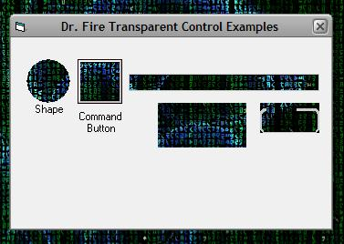



## Dr\. Fire Transparent Control

### Description

With this control, all you need to do is drop it on your form, and then ANYTHING on your form that is pruple will become transparent. This would be a useful tool for created custom shaped forms. On the example form provided, I have set a command button, label, frame control, text box, and shape control to purple, so they become transparent, incase you somehow got confused on how to use this.
 
### More Info
 

             |
---                |---
**Submitted On**   |2003-11-27 17:05:50
**By**             |[Jesse Seidel \(Dr\. Fire\)](https://github.com/Planet-Source-Code/PSCIndex/blob/master/ByAuthor/jesse-seidel-dr-fire.md)
**Level**          |Beginner
**User Rating**    |4.7 (56 globes from 12 users)
**Compatibility**  |VB 6\.0
**Category**       |[Custom Controls/ Forms/  Menus](https://github.com/Planet-Source-Code/PSCIndex/blob/master/ByCategory/custom-controls-forms-menus__1-4.md)
**World**          |[Visual Basic](https://github.com/Planet-Source-Code/PSCIndex/blob/master/ByWorld/visual-basic.md)
**Archive File**   |[Dr\_\_Fire\_T16770011272003\.zip](https://github.com/Planet-Source-Code/jesse-seidel-dr-fire-dr-fire-transparent-control__1-50160/archive/master.zip)

